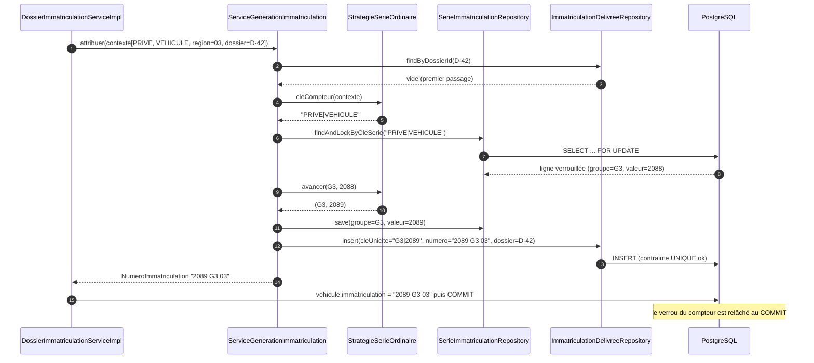
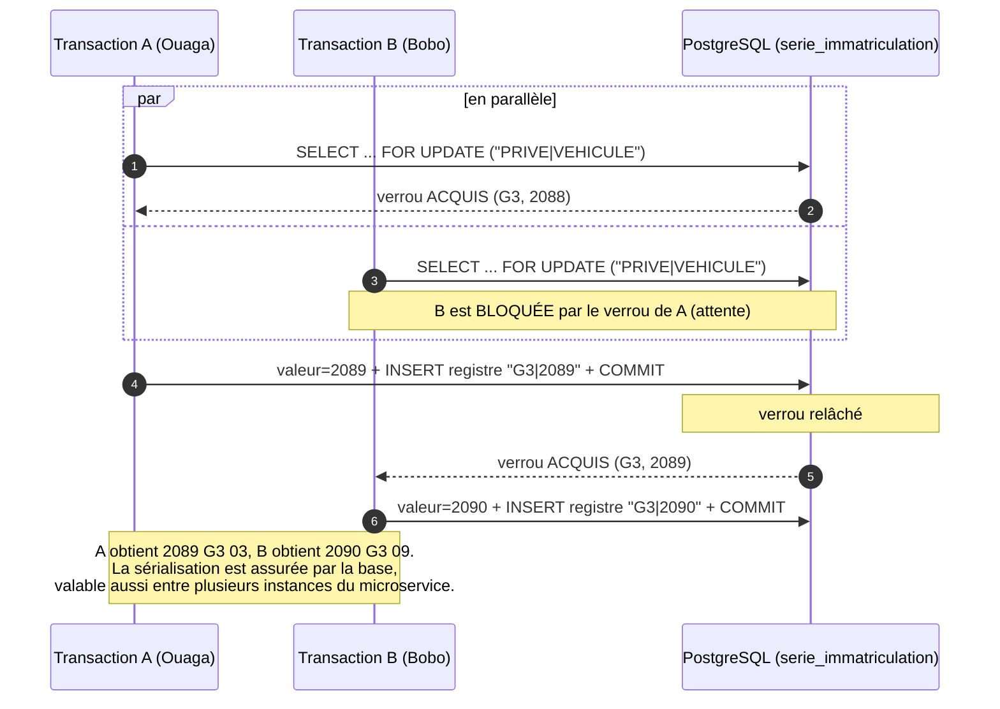
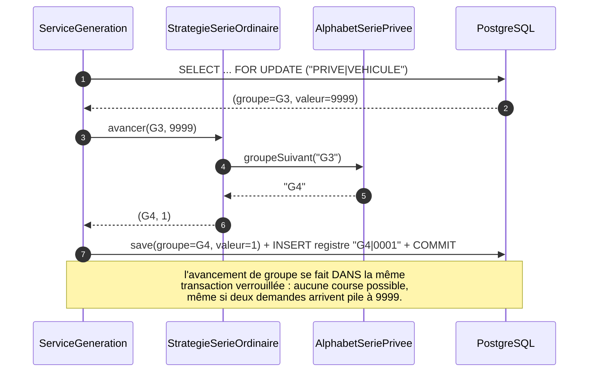
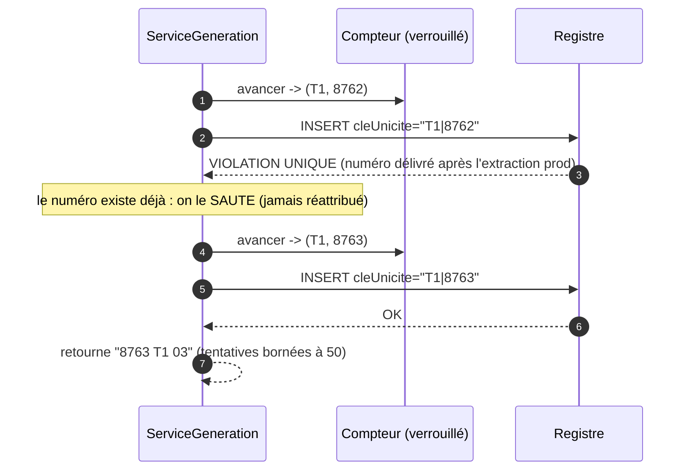
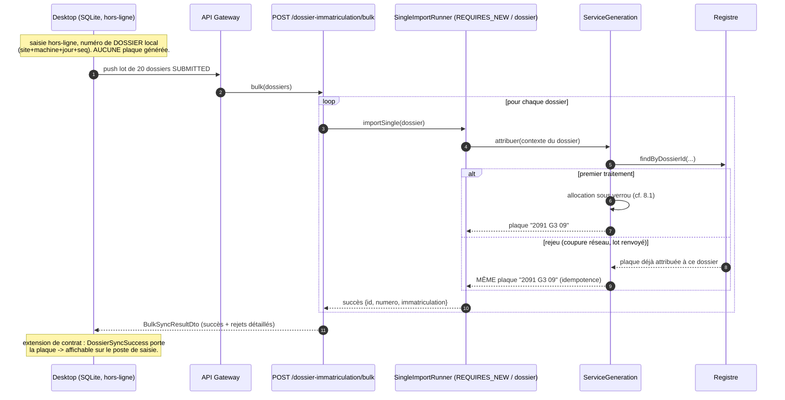
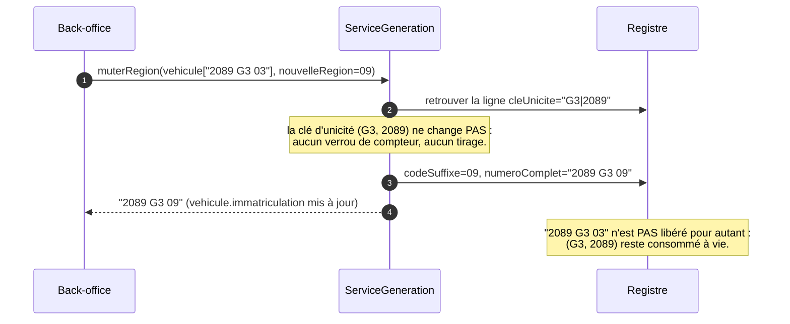

# Stratégie de génération des numéros d'immatriculation des véhicules — SIGATT

> **Objet** : définir, de bout en bout, l'algorithme de génération des numéros d'immatriculation
> (les « plaques », ex. `2089 G3 03`) pour le microservice `sigatt-immatriculation-service`,
> **sans aucun risque de doublon**, en conformité avec la réglementation burkinabè et en continuité
> du système existant (352 922 numéros réels analysés).
>
> **Sources de cette stratégie** :
> - Décret n°2017-0114/PRES/PM du 17 mars 2017 (modalités d'immatriculation, 52 articles) ;
> - Arrêté conjoint n°2017-0101/MTMUSR/M-SECU du 21 juillet 2017 (normes des plaques, 24 articles) ;
> - Arrêté nomenclature genres/carrosseries/sources d'énergie ; Décret n°2017-0994 (carte grise) ;
> - `prod.txt` : extraction massive du système existant, **voitures** (352 922 lignes) ;
> - `prod-moto.txt` : extraction du parc **motos** (1 048 575 lignes) — analysées statistiquement ;
> - `Cartes-grises-25-03-2024.xlsx` (11 colonnes) et `Moto.xlsx` (**58 colonnes** : statut du
>   propriétaire, région de résidence, dates, motifs, carte précédente…) — extractions détaillées de
>   mars-avril 2024, utilisées pour les **validations croisées** du §2.5 ;
> - Le code existant : `sigatt-backend` (socle CRUD, dossier d'immatriculation SIGATT-233),
>   `sigatt-desktop` (saisie hors-ligne + synchronisation bulk), référentiels et seeds SQL ;
> - Les **user stories** du produit (`user-stories/SIGATT_Jira_Import_VF_2026-07-07_Sprint_Juillet.csv`,
>   218 récits / 9 modules — dont US-CG-001…023 pour l'immatriculation et **US-CG-008** qui fixe
>   l'attribution automatique du numéro à la validation).
>
> **Déclinaisons** : `resume-regles-generation-immatriculation.md` (explicatif non technique) ·
> `fiche-validation-metier-generation-immatriculation.md` (fiche à faire valider/signer par les
> acteurs métier).

---

## 1. Ne pas confondre les deux numéros

Le projet manipule déjà **deux numérotations distinctes** — la confusion serait une source de bugs :

| | Numéro de **dossier** (existant) | Numéro d'**immatriculation** (objet de ce document) |
|---|---|---|
| Exemple | `OUAG 0000 210726 0001` | `2089 G3 03` |
| Rôle | Identifiant de la **demande** (traçabilité de saisie) | Identité **du véhicule** (la plaque physique) |
| Qui le génère | Backend (`DossierImmatriculationNumberHelper`) **ou** desktop (`NumeroGenerator`, hors-ligne) | **Exclusivement le serveur central** (décision clé, cf. §6.1) |
| Espace d'unicité | (site, machine, jour) → pas de coordination nécessaire | **National** → coordination obligatoire |
| Durée de vie | Le temps du traitement de la demande | **Permanente** (décret art. 3), jamais recyclée |

Le numéro de dossier peut être généré hors-ligne car son préfixe `site+machine+jour` partitionne
naturellement l'espace : deux machines ne peuvent pas se marcher dessus. **Le numéro d'immatriculation,
lui, vit dans un espace national séquentiel** (`0001 → 9999` par série) : il est impossible de le
partitionner par site sans violer la réglementation. C'est toute la difficulté que cette stratégie résout.

---

## 2. La réglementation décodée — anatomie d'un numéro

### 2.1 Structure générale

```
   2089        G3          03         (IT|AT)
  ┌────┐    ┌─────┐     ┌─────┐     ┌────────┐
  │NNNN│    │GROUPE│    │ RR  │     │MENTION │
  └────┘    └─────┘     └─────┘     └────────┘
 numéro     lettre(s)   code région  régime
 d'ordre    + chiffre   OU code      douanier
 0001-9999              mission      (optionnel)
```

Chaque composant est déterminé par un critère **précis** du décret (art. 2) :

| Composant | Déterminé par | Détail |
|---|---|---|
| **GROUPE** (lettre) | **Statut du propriétaire** | `A`=État/EPA · `B`=Collectivités · `C`=Parapublics · `P`=Police · `T`=Transporteurs publics/taxis · `CD`/`CC`=corps diplomatique/consulaire · `IN`=organisations internationales · `CMD`=chef de mission · **Privés = toute lettre SAUF `A,B,C,I,O,P,T,W`** (première lettre privée = `D`) |
| **GROUPE** (ordre lettre/chiffre) | **Type de véhicule** | Automobile = lettre puis chiffre (`G3`) ; **cycle à moteur = chiffre puis lettre (`3G`)** — deux espaces de numérotation distincts |
| **NNNN** | Séquence | 4 chiffres `0001→9999` ; chiffre du groupe `1→9` (`T` : `1→99`) ; après `9999`, passage au groupe suivant ; après épuisement des lettres simples : croisement deux à deux (`DE2`…`ZZ9`, art. 27). CD/CC/IN : bande **service `0001-0999`** / **personnel `1001-9999`**. Provisoires W/WW : 3 chiffres `001-999` |
| **RR** | **Résidence** ou **mission** | Code région `01-13` (séries ordinaires) ; **numéro d'identification de la mission/organisation** (CD/CC/IN/CMD, fixé par arrêté conjoint, art. 44) ; `99` final = export (WW) |
| **MENTION** | **Régime douanier** | (rien) = série normale · `IT` = franchise temporaire · `AT` = admission temporaire. La mention s'ajoute, le numéro vient du **même espace** que la série normale |

### 2.2 Règles de vie du numéro (décret art. 3)

- Le numéro est **permanent** tant que ne changent ni le statut du propriétaire, ni la résidence,
  ni le régime douanier.
- **Changement de région uniquement** → seul `RR` change, `NNNN + GROUPE` sont conservés.
- **Changement de statut ou de régime douanier** → ré-immatriculation complète (nouveau tirage).
- Un numéro n'est **jamais réutilisé** (les « trous » sont définitifs).

### 2.3 Ce que prouvent les données de production (352 922 numéros)

L'analyse statistique de `prod.txt` lève les ambiguïtés que les textes laissent ouvertes :

1. **Le compteur est NATIONAL par groupe** : sur toutes les séries testées (`D1`, `E5`, `F9`, `G1`, `G3`),
   **zéro** numéro n'existe avec deux régions différentes, et les numéros d'une même région sont
   entrelacés sur tout l'espace `0001-9999` (ex. dans `D1`, la région 01 possède 134 numéros éparpillés
   de 0113 à 9983 — un compteur par région aurait produit un bloc compact `0001-0134`).
   → **Clé d'unicité réelle d'une plaque ordinaire : `(NNNN, GROUPE)`. La région est descriptive.**
2. **Pour CD/CC/IN, le compteur est PAR MISSION** : `0001 CD 01`, `0001 CD 02`, `0001 CD 04`…
   coexistent. → Clé d'unicité diplomatique : `(NNNN, GROUPE, code mission)`.
3. **Remplissage séquentiel confirmé** : `D1…D9`, `E1…E9`, `F1…F9`, `G1`, `G2` sont remplies
   intégralement `0001→9999` ; la série privée active est **`G3` (dernier numéro observé : 2088)**.
   Autres compteurs vivants : `T1`≈8761, `A1`≈4237, `C1`≈1390, `P1`≈453, `B1`≈357.
4. **Bandes diplomatiques confirmées** : distribution bimodale de CD (`0001-0099` et `1000+`, rien entre).
5. **`IT`/`AT` consomment le même espace** : un numéro porté avec mention `IT` n'existe jamais sans elle.
6. **Les suffixes mission correspondent déjà aux référentiels SIGATT** : `IN 27` = UEMOA (308 véhicules),
   `IN 01` = PNUD, `IN 35` = HCR… — exactement les `code` seedés dans `organisation_internationale` ;
   idem `pays_mandataire` pour CD/CC.
7. Les doublons du fichier (42 705 lignes strictement identiques) sont des rééditions de carte grise,
   **toujours à région identique** — aucune contradiction avec les règles ci-dessus.
8. Les cycles (`1D`, `4E`…, chiffre avant lettre) sont quasi absents (4 lignes) : le parc moto fait
   l'objet d'une extraction séparée, analysée ci-dessous.

### 2.4 Le cas des MOTOS — analyse de `prod-moto.txt` (1 048 575 lignes)

Le parc moto est **trois fois plus volumineux** que le parc automobile et suit une logique
d'attribution legacy **différente**. Constats vérifiés :

1. **Format inversé confirmé** (décret art. 27) : `NNNN <chiffre><lettres> RR` — ex. `0042 5M 03`.
   Mêmes 13 régions (mais distribution bien moins centralisée : Centre 38 % contre 79 % pour les
   voitures — la moto est le véhicule de tout le pays), mêmes mentions (`IT` : 1 899, `AT` : 6),
   mêmes séries catégorielles embryonnaires (`1A` État : 4 584, `1B` Collectivités : 2 238,
   `1C` : 235, `1P` Police : 271, `1T` : 93).
2. **Même clé d'unicité** : national par groupe, zéro numéro multi-région (testé sur `1D` et `5M`).
3. **Le croisement à deux lettres est DÉJÀ actif** : l'alphabet simple est épuisé et la prod contient
   `DD`, `DE`, `DF`, `DG`, `DH` — **la première lettre reste `D`, la seconde avance dans l'alphabet
   privé**. Cette observation tranche empiriquement la mécanique du « croisement deux à deux » de
   l'art. 27 : `…9Z → DD → DE → DF → DG → DH → (DJ)…`. Front actuel observé : `1DH` (max 6615).
4. **⚠️ L'attribution legacy moto n'est PAS un compteur séquentiel propre** : environ 135 groupes
   (`L…Z` × chiffres 1-9 et `DD…DG` × 1-9) sont remplis **en parallèle**, chacun à ~33 % de densité,
   avec des numéros **éparpillés sur tout l'espace 0001-9999** (ex. `5M` présent : 0001, 0007, 0009,
   0010, 0014… max 9999). Ce motif est la signature de **stocks de plaques pré-imprimées** écoulés
   par lots (guichets/concessionnaires) : la date d'immatriculation et le numéro sont décorrélés.
   Seuls les groupes anciens (`D…J`, tous chiffres) sont complets.
5. **Conséquence capitale pour l'amorçage** : pour les motos, un « trou » n'est **pas un numéro
   libre** — c'est potentiellement une plaque déjà fabriquée, en stock, qui sera posée demain.
   Il est donc interdit d'amorcer un compteur au milieu des groupes legacy. **Le compteur moto de
   SIGATT démarrera sur un groupe VIERGE, au-delà de tout ce qui est observé** (après `DH` →
   **`DJ`**, `I` étant exclu), et tous les groupes antérieurs (`D` simple → `DH`) sont considérés
   comme **intégralement consommés** (importés/bloqués au registre).
6. **Le fichier est coupé à la limite Excel** (1 048 575 = 2²⁰−1) — la coupe tombe en fin de tri
   (dernière ligne `9999 9X 09`, perte de quelques lignes `9Y`/`9Z` au plus) mais impose une
   **ré-extraction sans Excel** (CSV direct) avant la bascule (cf. §10).

### 2.5 Validations croisées par les extractions détaillées (Excel, mars-avril 2024)

Deux extractions riches (`Cartes-grises-25-03-2024.xlsx`, 11 colonnes ; `Moto.xlsx`, **58 colonnes** :
statut du propriétaire, région de résidence, dates de demande/inscription, motif, carte précédente…)
ont permis de **prouver empiriquement** ce qui n'était jusqu'ici que déduit :

1. **Mapping des codes région VALIDÉ à 99 %** : le croisement « suffixe de plaque × libellé de la
   région de résidence » sur 1 048 575 motos donne, pour chacun des 13 codes, une région dominante
   à 99 % — exactement la table de l'annexe A (01=Boucle du Mouhoun … 03=Centre … 13=Sud-Ouest).
   La décision #1 passe de « proposition » à « fait mesuré » (la confirmation officielle reste une
   formalité).
2. **Correspondance statut → série VALIDÉE** : `EPE`→A (86 %), `COLLECT`→B (98 %), `PARAPUB`→C (90 %),
   `POLICE`→P (91 %), `PUB`→T (94 %), `DIPL_*`→CD (100 %), `INT_MISS`→IN (85 %), `STD`→lettres privées.
   Le legacy applique bien le décret ; le bruit résiduel (1-15 %) = erreurs de saisie historiques.
3. **Hypothèse des stocks pré-imprimés moto PROUVÉE** : la corrélation entre numéro d'ordre et date
   de demande est **quasi nulle (r ≈ +0,02 à +0,08)** dans tous les groupes témoins — les numéros
   bas et hauts d'un même groupe sont posés sur la même période 2019→2024, y compris dans les groupes
   « pleins » comme `1D`. Un groupe moto n'a JAMAIS été rempli séquentiellement : le démarrage sur
   série vierge (`DJ`) est la seule option sûre.
4. **Fraîcheur des données** : demandes jusqu'au **05/04/2024** (motos) et extraction voitures datée
   du 25/03/2024 → les fronts observés (`G3`@2088, `1DH`@6615) datent d'avril 2024 ; la ré-extraction
   à la bascule (§10.3) est indispensable. `Moto.xlsx` est lui aussi plafonné à 1 048 576 lignes
   (limite Excel, feuille de débordement vide).
5. **Vie du parc** (motos) : 96,8 % de premières immatriculations (`newIssuance`/`newVehicle`),
   34 352 changements de propriétaire (numéro conservé), 16 814 duplicata perte + 16 158
   renouvellements (même numéro), 28 281 reprises de l'ancien système (`lossLegacy`), 1 855
   transformations. **25 053 cartes précédentes au format pré-2017** (`11 AA5302`) et ~22 000 en
   variante espacée (`NN AA NNNN`) : la transition de l'art. 50 est visible — le champ
   `immatriculationPrecedente` du dossier devra accepter aussi ces anciens formats (validation
   assouplie, cf. §11).

### 2.6 Voitures vs motos — les différences en un tableau

| | **Voitures** (`prod.txt`, 353 k) | **Motos** (`prod-moto.txt`, 1,05 M) |
|---|---|---|
| Format du groupe | Lettre puis chiffre : `2089 G3 03` | Chiffre puis lettre(s) : `0042 5M 03`, `1234 1DD 09` |
| Compteur SIGATT | `PRIVE\|VEHICULE` (et compteurs catégoriels `A/B/C/P/T`) | `PRIVE\|CYCLE` — **espace totalement disjoint** des voitures |
| État du legacy | Remplissage **séquentiel propre** : `D1→…→G2` pleines, front dense `G3` @ 2088 | Remplissage **éparpillé multi-groupes** (stocks pré-imprimés) : `D…J` pleins, `K…Z` + `DD…DG` à ~33 % partout, front `1DH` @ 6615 |
| Amorçage SIGATT | **Continuité** : reprise à `G3`, 2088 + marge (les trous derrière le front restent interdits) | **Rupture propre** : démarrage sur groupe **vierge `DJ`** (`0001 1DJ RR`) ; tout ce qui précède = consommé |
| Croisement 2 lettres | Pas encore atteint (~1,26 M de numéros de marge) | **Déjà actif** — ordre observé : 2ᵉ lettre avance (`DD→DE→…`), réutilisé tel quel pour les voitures le moment venu |
| Avancement dans un groupe | `G3: 9999 → G4: 0001` (2ᵉ caractère = chiffre, puis lettre suivante) | Identique sur la forme normalisée ; seul l'**affichage** est inversé |
| Mentions douanières | `IT` 3 053 / `AT` 1 485 | `IT` 1 899 / `AT` 6 |
| Régions | Centre 79 %, Hauts-Bassins 11 % | Centre 38 % — parc réparti sur tout le territoire |
| Nombre de plaques produites | 2 (avant + arrière, art. 4) | 1 |

**Point d'architecture** : ces différences ne créent PAS deux algorithmes. La normalisation interne
est commune (`groupe='DJ1'`, `numeroOrdre`, `codeSuffixe`, `typeSupport`) ; le `TypeSupportPlaque`
(`VEHICULE`/`CYCLE`) pilote (a) le choix du compteur (`PRIVE|VEHICULE` vs `PRIVE|CYCLE`),
(b) le **formatage à l'affichage** (`G3` vs `3G`, `DD1` vs `1DD`) et (c) le nombre de plaques.
Même moteur, mêmes cinq couches anti-doublon, deux lignes de compteur.

---

## 3. L'existant dans le code — ce qu'on réutilise, ce qu'on corrige

### 3.1 Backend (`sigatt-immatriculation-service`)

| Élément | État | Usage dans la stratégie |
|---|---|---|
| `VehiculeEntity.immatriculation` | Existe (String libre, **sans contrainte unique**, jamais généré) | **Champ cible** de la plaque — ajouter la contrainte d'unicité |
| `VehiculeEntity.numeroImmatriculationProvisoire` | Existe (saisie libre) | Plaques provisoires W/WW (phase ultérieure) |
| `DossierImmatriculationEntity.nouvelleImmatriculation` / `immatriculationPrecedente` | Existent (saisis, non exploités) | Déclencheur du tirage / ré-immatriculation |
| Patron **séquence sous verrou pessimiste** (`DossierImmatriculationSequenceEntity` + `findAndLockByPrefix` `@Lock(PESSIMISTIC_WRITE)` + retries) | Existant, éprouvé (testé sous concurrence par `testCreateConcurrentNominalCases`) | **Répliqué à l'identique** pour les compteurs de séries (cf. §7) |
| `StatutProprietaire.immatCode` | ⚠️ Seed **erroné** : énumération naïve `A→N` (Privé=`B`, Police=`D`, Org. internationale=`I` — contredit le décret : B=Collectivités, P=Police, I=lettre interdite) | **À re-seeder** avec les codes de catégorie réglementaires (cf. annexe B) — c'est la clé de résolution de la stratégie |
| `PaysMandataire.code` / `OrganisationInternationale.code` | Corrects (validés à 100 % contre prod) | Suffixe mission des plaques CD/CC/IN/CMD |
| `TypeVehicule` / `CategorieVehicule` (genre 1 = Motocycle) | Existent (`nombrePlaque` non seedé) | Distinction automobile/cycle (ordre lettre-chiffre) + nombre de plaques à produire (2 auto / 1 moto-remorque, décret art. 4) |
| `RegimeDouanier` | Référentiel existant, **non seedé** | Source de la mention `IT`/`AT` — ajouter la colonne de correspondance (cf. §8, fichier 9) |
| `Region` (referentiel-service) | Entité avec `code`, **table non seedée** | Source du code région `01-13` — seed à créer |
| Table `parametre` (referentiel-service, clé/valeur + écran admin) | Existante | Paramètres de l'algorithme (activation, marge d'amorçage) |

### 3.2 Desktop (`sigatt-desktop`) — la contrainte hors-ligne

Analyse complète du repo (JavaFX 25 + SQLite, sync par lots de 20 vers
`POST /immatriculation-service/api/dossier-immatriculation/bulk`) :

- **Le desktop ne génère AUCUNE plaque** — il ne connaît que le numéro de **dossier**
  (`NumeroGenerator` : `siteCode + codeMachine + ddMMyy + séquence journalière locale`), attribué à la
  soumission. Aucune table, aucun champ, aucune logique de plaque.
- La corrélation de la réponse bulk se fait **par numéro de dossier**
  (`DossierSyncSuccess { id, numero }` / `DossierSyncFailure { numeroDossier, errorMessage, dateErreur }`).
- Le desktop peut **rejouer** un lot (reprise après coupure : `IN_PROGRESS → PENDING_PUSH`) : le serveur
  doit être **idempotent** par dossier.
- Conséquence architecturale : la génération de plaque peut (et doit) être **100 % centrale**, il n'y a
  aucun générateur concurrent à coordonner côté clients. Si l'on veut afficher la plaque sur le poste de
  saisie, il faudra **étendre le contrat de retour** (`DossierSyncSuccess`) — champ additionnel, rétrocompatible.

---

### 3.3 Le workflow cible, confirmé par les user stories (juillet 2026)

Les 23 stories du module Immatriculation dessinent la chaîne de traitement et **fixent le
déclencheur de la génération** :

```
Usager en ligne (US-CG-001..005)          Opérateur de saisie SIM (US-CG-007, 011..023)
   initier / corriger / suivre               saisie guichet des 14 natures de demande
            │                                              │
            ▼                                              │
Opérateur de réception (US-CG-006)                         │
   réceptionner / transmettre / retour correction          │
            └──────────────────┬───────────────────────────┘
                               ▼
              VALIDATEUR SIM (US-CG-008) — interface web centrale
     « Valider une demande (Le système attribue AUTOMATIQUEMENT un numéro
       d'immatriculation) » · rejeter / envoyer en correction (motif obligatoire,
       notification à l'initiateur)
                               ▼
              Production et remise des cartes (module PR)
```

- **Le point d'appel du moteur est donc l'action « Valider » du validateur SIM** (US-CG-008) —
  la décision #3 du §12 est tranchée par le produit. Les demandes qui ne nécessitent pas de
  nouveau numéro suivent le même workflow, sans appel au moteur.
- **Systèmes externes** : IMPRO fournit les **immatriculations provisoires** (le champ
  `numeroImmatriculationProvisoire` rappelle les données depuis IMPRO) — la série provisoire
  W/WW est donc **hors périmètre SIGATT, confirmé** ; le CCVA fournit les données
  véhicule/visite technique par le numéro de châssis ; l'ONI les identités par NIP.
- Les stories éclairent aussi des champs du modèle : `structureBeneficiaire` et `referenceLettre`
  servent à la **banalisation** (US-CG-020/021).

**Effet de chaque nature de demande sur le numéro** (déduit des US + décret art. 3 — à faire
valider par la fiche métier) :

| Nature de demande (US) | Effet sur le numéro d'immatriculation |
|---|---|
| Première mise en circulation (US-CG-007) | **Tirage d'un nouveau numéro** à la validation |
| Renouvellement papier/polycarbonate (US-CG-011/012) | Numéro conservé ; ⚠️ si l'ancienne plaque est au **format pré-2017** → tirage d'un numéro au format actuel (art. 50) ; si statut/régime modifiés à cette occasion → tirage |
| Changement d'adresse (US-CG-013) | **Recomposition** : seuls les 2 chiffres de région changent — aucun tirage (art. 3) |
| Changement de propriétaire (US-CG-014/015) | Numéro conservé si même statut et même régime ; **tirage** si le statut ou le régime douanier change (le formulaire capture le nouveau statut/régime) |
| Gage / levée de gage (US-CG-016/017) | Numéro conservé (mention du créancier sur la carte) |
| Duplicata perte/vol (US-CG-018/019) | Numéro conservé (réédition de la carte) |
| Banalisation (US-CG-020) | **Tirage en série privée** (le véhicule d'État reçoit une plaque banalisée ; structure bénéficiaire + référence de lettre) |
| Levée de banalisation (US-CG-021) | **Tirage dans la série du statut réel** (retour à la catégorie d'origine) |
| Transformation (US-CG-022/023) | Numéro conservé — la story exclut explicitement la modification de « la série, la marque, le modèle et le type » |

## 4. Principes directeurs de la stratégie

1. **Génération exclusivement côté serveur central** — jamais en desktop, jamais en front. Un seul
   point d'attribution = un seul espace à protéger.
2. **Un numéro n'est jamais calculé, il est ALLOUÉ** : l'état des compteurs vit en base de données,
   modifié sous verrou. On ne déduit jamais « le prochain numéro » d'un `MAX()` sur les véhicules
   (fragile face aux imports et aux suppressions logiques).
3. **Défense en profondeur contre les doublons** (cf. §6) : verrou pessimiste + registre avec contrainte
   d'unicité en base + idempotence par dossier + amorçage par migration du legacy.
4. **Les trous sont légaux, le recyclage est interdit** : un échec de transaction peut consommer un
   numéro pour rien (rare) — c'est accepté (la prod en est pleine) ; réutiliser un numéro ne l'est jamais.
5. **Continuité du legacy** : les compteurs démarrent là où le système existant s'est arrêté
   (série privée `G3`, etc.) ; tous les numéros historiques sont importés dans le registre pour rendre
   toute collision physiquement impossible.
6. **Ouvert/fermé** : chaque famille réglementaire est une **stratégie** interchangeable (pattern
   Strategy) ; ajouter les séries W/WW ou les immatriculations particulières plus tard = ajouter une
   classe, sans toucher au moteur.
7. **Conventions du projet respectées** : socle `lib-commons`, nommage et Javadoc en français,
   checkstyle bloquant, `final` sur les paramètres, pas de méthode publique `final` dans les services
   proxifiés, clés i18n `<entité>.<cas>`, rôles Keycloak `{ressource}-write`.

---

## 5. Modèle de données cible

Deux nouvelles tables dans `sigatt-immatriculation-service`, une colonne d'unicité sur `vehicule`.

### 5.1 `serie_immatriculation` — l'état des compteurs vivants

Réplique du patron `dossier_immatriculation_sequence` (une ligne = un compteur, verrouillée à
l'allocation) enrichie du **groupe courant** :

```sql
CREATE TABLE serie_immatriculation (
    cle_serie       VARCHAR(64) PRIMARY KEY,  -- identifiant du compteur (cf. ci-dessous)
    groupe_courant  VARCHAR(8)  NOT NULL,     -- ex. 'G3', 'A1', 'T1' ; sigle pour les diplomatiques
    valeur_courante INTEGER     NOT NULL      -- dernier numéro d'ordre attribué (0 si vierge)
);
```

**Convention de clé (`cle_serie`)** — elle encode la portée d'unicité prouvée en §2.3 :

| Famille | Clé | Exemples de lignes |
|---|---|---|
| Privés | `PRIVE\|VEHICULE` et `PRIVE\|CYCLE` | `(PRIVE\|VEHICULE, G3, 2088)` · `(PRIVE\|CYCLE, DJ1, 0)` — groupe vierge, cf. §2.4 |
| Lettre fixe (État, Collectivités, Parapublics, Police) | `<CAT>\|<SUPPORT>` | `(ETAT\|VEHICULE, A1, 4237)` |
| Transporteurs publics | `TRANSPORT\|<SUPPORT>` | `(TRANSPORT\|VEHICULE, T1, 8761)` |
| Diplomatiques (compteur **par mission et par bande**) | `<SIGLE>\|<BANDE>\|<code mission>` | `(CD\|SERVICE\|01, CD, 45)`, `(IN\|PERSONNEL\|27, IN, 1023)` |

Une ligne par compteur = **un point de verrouillage par compteur** : deux tirages simultanés sur des
séries différentes (ex. un privé et un taxi) ne se bloquent pas mutuellement.

### 5.2 `immatriculation_delivree` — le REGISTRE (cœur de l'anti-doublon)

Toute plaque qui existe — générée par l'algorithme, **migrée du legacy**, ou saisie manuellement
(source `INTERNE`) — a une ligne ici. C'est le filet de sécurité ultime, garanti par la base :

```sql
CREATE TABLE immatriculation_delivree (
    id              UUID PRIMARY KEY,
    cle_unicite     VARCHAR(32) NOT NULL,     -- la clé réglementaire, cf. ci-dessous
    numero_ordre    INTEGER     NOT NULL,     -- 2089
    groupe          VARCHAR(8)  NOT NULL,     -- 'G3', 'CD', 'CMD'
    code_suffixe    VARCHAR(4)  NOT NULL,     -- région '03' ou mission '27'
    mention         VARCHAR(2),               -- NULL | 'IT' | 'AT'
    numero_complet  VARCHAR(24) NOT NULL,     -- '2089 G3 03' (affichage)
    type_support    VARCHAR(16) NOT NULL,     -- VEHICULE | CYCLE
    source          VARCHAR(16) NOT NULL,     -- GENEREE | MIGREE | INTERNE
    vehicule_id     UUID,                     -- rattachement (nullable pour la migration)
    dossier_id      UUID,                     -- dossier à l'origine du tirage (idempotence)
    -- + colonnes d'audit AbstractAuditEntity (created_by, created_date, deleted, ...)
    CONSTRAINT uk_immatriculation_cle_unicite UNIQUE (cle_unicite)
);
CREATE INDEX idx_immat_delivree_dossier ON immatriculation_delivree (dossier_id);
```

**`cle_unicite`** matérialise la clé réglementaire, construite par la stratégie :

- séries ordinaires : `GROUPE|NNNN` → `G3|2089` (la région n'y figure PAS — art. 3 : elle peut changer) ;
- diplomatiques : `SIGLE|code mission|NNNN` → `CD|01|0045` (le compteur est par mission) ;
- CMD : `CMD|code mission` → `CMD|02` (un seul véhicule par mission, art. 20).

> **Pourquoi un registre et pas seulement une contrainte sur `vehicule.immatriculation` ?**
> (1) l'unicité réglementaire porte sur `(NNNN, GROUPE)` alors que la chaîne complète contient la
> région (qui peut changer) ; (2) le registre absorbe la **migration des 353 000 numéros legacy**
> sans créer de véhicules fantômes ; (3) il historise les plaques même après ré-immatriculation
> (jamais de recyclage) ; (4) il neutralise les collisions venant des saisies `INTERNE`/bulk.

### 5.3 Modifications d'entités existantes

- `VehiculeEntity.immatriculation` : ajouter `unique = true` (filet supplémentaire, la chaîne complète
  est de fait unique).
- `RegimeDouanierEntity` : ajouter la colonne **`mentionSerie`** (`NULL`/`IT`/`AT`) — c'est le régime
  douanier qui détermine la mention (décret art. 7) ; seed associé.
- Seed `statut_proprietaire` : **corriger `immat_code`** (cf. annexe B).
- Seed `region` (referentiel-service) : codes `01→13` (cf. annexe A, à faire valider).

---

## 6. La stratégie anti-doublon — défense en profondeur

Aucune couche ne se suffit à elle seule ; leur superposition rend le doublon **physiquement impossible**.

### Couche 1 — Un seul générateur (architectural)

Toute attribution passe par `ServiceGenerationImmatriculation` côté serveur central. Le desktop, le
back-office et le bulk **reçoivent** des plaques, ils n'en fabriquent jamais. (Vérifié : le desktop n'a
aucune logique de plaque ; sa saisie hors-ligne ne porte que le numéro de dossier.)

### Couche 2 — Sérialisation par verrou pessimiste (concurrence)

L'allocation incrémente `serie_immatriculation` sous `SELECT … FOR UPDATE`
(`@Lock(PESSIMISTIC_WRITE)`, patron déjà éprouvé dans le projet). Deux transactions concurrentes sur le
**même compteur** sont sérialisées par PostgreSQL lui-même — y compris entre **plusieurs instances**
du microservice (le verrou est en base, pas en JVM). L'avancement de série (9999 → groupe suivant)
se fait **dans la même transaction verrouillée** : aucune course possible sur le changement de groupe.

### Couche 3 — Contrainte UNIQUE du registre (filet base de données)

Dans la **même transaction** que l'incrément, l'algorithme insère la ligne du registre. Si un numéro
existe déjà (legacy plus avancé que le compteur, saisie manuelle passée avant l'amorçage…), l'INSERT
viole `uk_immatriculation_cle_unicite` → l'algorithme **avance le compteur et retente** (borné, 50
tentatives comme le patron existant). Le doublon ne peut pas atteindre la base, même en cas de bug
du compteur : c'est PostgreSQL qui a le dernier mot.

### Couche 4 — Idempotence par dossier (rejeu réseau)

Le desktop rejoue les lots interrompus. Avant tout tirage : si le registre contient déjà une ligne
`dossier_id = <dossier>` (ou si le véhicule du dossier porte déjà une plaque), **on renvoie la plaque
existante au lieu d'en tirer une nouvelle**. Un même dossier ne peut jamais consommer deux numéros.

### Couche 5 — Amorçage par migration + validation des saisies (données)

- Les 353 000 numéros de `prod.txt` sont importés dans le registre (`source = MIGREE`) et les compteurs
  amorcés à `max observé + marge paramétrable` (table `parametre`). Le générateur ne peut donc jamais
  réémettre un numéro historique — même si l'amorçage était mal calibré, la couche 3 le rattrape.
- Toute plaque **saisie** (source `INTERNE`, champ `immatriculationPrecedente`, bulk) est validée par
  les expressions régulières par catégorie (cf. §11) puis **enregistrée au registre** : elle entre dans
  l'espace protégé.

---

## 7. Architecture logicielle

### 7.1 Vue d'ensemble des composants

```
sigatt.immatriculation.service
├── domain/
│   ├── SerieImmatriculationEntity          (compteur : cleSerie PK, groupeCourant, valeurCourante)
│   └── ImmatriculationDelivreeEntity       (registre : cleUnicite UNIQUE + composants)
├── repository/
│   ├── SerieImmatriculationRepository      (findAndLockByCleSerie @Lock(PESSIMISTIC_WRITE))
│   └── ImmatriculationDelivreeRepository   (existsByCleUnicite, findByDossierId...)
├── service/immatriculation/
│   ├── ServiceGenerationImmatriculation    (interface : attribuer(contexte) -> NumeroImmatriculation)
│   ├── impl/ServiceGenerationImmatriculationImpl   (façade transactionnelle, idempotence, retries)
│   ├── ContexteGenerationImmatriculation   (record : tout ce qui détermine la plaque)
│   ├── NumeroImmatriculation               (value object : composants + format() + cleUnicite())
│   └── strategie/
│       ├── StrategieSerieImmatriculation   (interface : supporte(cat) / prochainNumero(ctx))
│       ├── StrategieSerieOrdinaire         (A, B, C, P, T, PRIVE — compteur national)
│       ├── StrategieSerieDiplomatique      (CD, CC, IN — compteur par mission, bandes)
│       ├── StrategieChefMissionDiplomatique(CMD — sans compteur, unicité par mission)
│       └── AlphabetSeriePrivee             (utilitaire : ordre des groupes privés, avancement)
└── enums (sigatt.commons.enums)
    ├── CategorieImmatriculation            (ETAT, COLLECTIVITE, PARAPUBLIC, POLICE, TRANSPORT_PUBLIC,
    │                                        PRIVE, CD_SERVICE, CD_PERSONNEL, CC_SERVICE, CC_PERSONNEL,
    │                                        IN_SERVICE, IN_PERSONNEL, CMD, PARTICULIER)
    ├── MentionSerie                        (IT, AT)
    └── TypeSupportPlaque                   (VEHICULE, CYCLE)
```

### 7.2 Résolution de la stratégie — d'où viennent les composants

Le **contexte** est intégralement constructible depuis un dossier d'immatriculation existant
(les FK sont déjà résolues par `DossierImmatriculationRelationHelper`) :

| Donnée du contexte | Source dans le modèle actuel |
|---|---|
| Catégorie (→ stratégie + lettre) | `dossier.statutProprietaire.immatCode` (re-seedé, annexe B) |
| Type de support (véhicule/cycle) | `vehicule.typeVehicule` / genre (catégorie `MOTOCYCLE` → `CYCLE`) |
| Code région `RR` | Résidence du propriétaire (localité → province → région, referentiel) ; repli : région du site d'enrôlement (`dossier.siteEnrollementId`) — **décision à valider, cf. §12** |
| Code mission (CD/CC/CMD) | `dossier.paysMandataire.code` |
| Code organisation (IN) | `dossier.organisationInternationale.code` |
| Mention `IT`/`AT` | `vehicule.regimeDouanier.mentionSerie` |

La façade choisit la stratégie par `strategies.stream().filter(s -> s.supporte(categorie))` —
l'ajout d'une famille (W/WW, PARTICULIER) est une nouvelle classe `@Component`, rien d'autre ne change.

### 7.3 L'algorithme complet en pseudo-code (6 blocs)

Pseudo-code en français, lisible par un développeur comme par un analyste. Les numéros de
scénarios `Sxx` renvoient au catalogue du §16.

**Bloc 1 — Point d'entrée : la validation d'une demande (US-CG-008)**

```
traiterValidationDemande(dossier) :                        # appelé par l'API "Valider" du validateur SIM
  effet = effetSurNumero(dossier.typeDemande)              # donnée CONFIGURÉE par nature (cf. §15.4)

  selon effet :
    TIRAGE :                                               # ex. première mise en circulation (S01..S16)
        contexte = construireContexte(dossier)             # bloc 2
        numero   = attribuer(contexte)                     # bloc 3
        vehicule.immatriculation = numero.format()

    RECOMPOSITION_REGION :                                 # changement d'adresse (S34)
        recomposerRegion(dossier.vehicule, nouvelleRegion) # bloc 5 — AUCUN tirage

    CONSERVATION :                                         # duplicata, gage, transformation, renouvellement simple (S38, S41)
        rien — le numéro existant reste inchangé

    CONDITIONNEL_STATUT_REGIME :                           # changement de propriétaire, renouvellement (S35..S37)
        si dossier.nouveauStatut != vehicule.statutActuel
           OU dossier.nouveauRegime != vehicule.regimeActuel
           OU formatPre2017(vehicule.immatriculation) :    # art. 50 : bascule des anciennes plaques
             -> comme TIRAGE (l'ancien numéro RESTE consommé au registre)
        sinon -> comme CONSERVATION

    TIRAGE_SERIE_PRIVEE :                                  # banalisation (S39) : catégorie forcée PRIVE
        contexte = construireContexte(dossier, categorieForcee = PRIVE)
        numero   = attribuer(contexte)

    TIRAGE_SERIE_STATUT :                                  # levée de banalisation (S40) : retour à la série du statut réel
        comme TIRAGE (le statut réel est dans le dossier)
```

**Bloc 2 — Construction et contrôle du contexte**

```
construireContexte(dossier) :
  statut = dossier.statutProprietaire
  si statut absent            -> erreur "immatriculation.statut.requis"          (S23)
  categorie = CategorieImmatriculation depuis statut.immatCode
  si categorie == PARTICULIER -> erreur "hors génération automatique" (art. 42)

  support = CYCLE si genre du véhicule == MOTOCYCLE, sinon VEHICULE
  si typeVehicule absent      -> erreur "immatriculation.type.vehicule.requis"

  selon categorie :
    CD_* / CC_* / CMD : codeSuffixe = paysMandataire.code
                        si absent -> erreur "immatriculation.mission.requise"    (S25)
    IN_*              : codeSuffixe = organisationInternationale.code
                        si absent -> erreur (idem)
    autres            : codeSuffixe = codeRegion(résidence du propriétaire)
                        repli : région du site d'enrôlement
                        si indéterminable -> erreur "immatriculation.region.indeterminable" (S24)

  mention = regimeDouanier.mentionSerie                    # NULL | IT | AT (cf. §15.3)
  retour Contexte(dossierId, categorie, support, codeSuffixe, mention)
```

**Bloc 3 — Allocation sous verrou (le cœur anti-doublon)**

```
attribuer(contexte) :                                      # @Transactional (REQUIRED)
  1. IDEMPOTENCE : si registre.findByDossierId(ctx.dossierId) existe
       -> retourner la plaque déjà attribuée               # rejeu bulk/web sans double consommation (S31)

  2. cas particulier CMD (pas de compteur) :
       cleUnicite = "CMD|" + codeMission
       TENTER insert registre -> violation = "mission a déjà sa plaque CMD" (S22)
       retour "<codeMission> CMD"

  3. strategie = résoudre(ctx.categorie)                   # pattern Strategy
     cleSerie  = strategie.cleCompteur(ctx)                # "PRIVE|VEHICULE", "CD|SERVICE|01"...

  4. boucle (max 50 tentatives) :                          # borne anti-boucle infinie (S33)
       a. serie = repo.findAndLockByCleSerie(cleSerie)     # SELECT ... FOR UPDATE ; création si absente
                                                           #   (collision d'init rattrapée — patron existant)
       b. (groupe, ordre) = avancer(serie, strategie)      # bloc 4
       c. serie.groupeCourant = groupe ; serie.valeurCourante = ordre ; save
       d. numero = NumeroImmatriculation(ordre, groupe, ctx.codeSuffixe, ctx.mention, ctx.support)
       e. TENTER insert registre(numero.cleUnicite(), composants, source=GENEREE, dossierId)
            succès               -> retourner numero       # verrou relâché au commit appelant (S29)
            violation d'unicité  -> continuer              # numéro legacy/saisi : SAUTÉ à jamais (S30)

  5. après 50 échecs -> SigattErrorResponse(CONFLICT, "immatriculation.generation.epuisement")
```

**Bloc 4 — Avancement d'un compteur (dans la transaction verrouillée)**

```
avancer(serie, strategie) :
  si serie.valeurCourante < strategie.borneMax(serie)      # 9999 ; 0999 pour bande SERVICE ; 999 pour W/WW futur
      -> retour (serie.groupeCourant, valeurCourante + 1)

  # la borne est atteinte : changement de groupe DANS le même verrou (aucune course possible, S17)
  selon strategie :
    SerieOrdinaire PRIVE :
        groupeSuivant : chiffre 1->9 (G3->G4), puis lettre suivante de l'ALPHABET_PRIVE (G9->H1, S18),
        après Z9 : croisement — 2e lettre parcourt l'alphabet (Z9 -> DD1, DD9 -> DE1..., S19)
        -> retour (groupeSuivant, 1)
    SerieOrdinaire à lettre fixe (A/B/C/P) :
        chiffre 1->9 (A1->A2) ; après A9 : ERREUR "serie.categorielle.epuisee"   # décret muet — décision métier (§17)
    Transport (T) :
        chiffre 1->99 (T9->T10, S20) ; après T99 : ERREUR idem
    Diplomatique (CD/CC/IN) :
        bande SERVICE pleine (0999) ou PERSONNEL pleine (9999)
        -> ERREUR "bande.diplomatique.pleine" (escalade métier, S21)

ALPHABET_PRIVE = D E F G H J K L M N Q R S U V X Y Z       # sans I, O ; sans A, B, C, P, T, W
```

**Bloc 5 — Mutation de région (art. 3, sans tirage)**

```
recomposerRegion(vehicule, nouvelleRegion) :
  ligne = registre.parCleUnicite(vehicule.plaque)          # la clé (groupe, ordre) ne change PAS
  ligne.codeSuffixe   = nouvelleRegion.code
  ligne.numeroComplet = reformater(...)
  vehicule.immatriculation = ligne.numeroComplet           # l'ancienne combinaison n'est PAS libérée (S34)
```

**Bloc 6 — Validation d'une plaque saisie (INTERNE / bulk / plaque précédente)**

```
validerPlaqueSaisie(plaque, contexte) :
  si champ "immatriculation précédente" ET formatPre2017(plaque) -> accepter sans registre (R12, S44)
  si non conforme à la regex de sa catégorie (§11) -> erreur "immatriculation.format.invalide" (S27)
  TENTER insert registre(source = INTERNE)                 # entre dans l'espace protégé (S28)
    violation -> erreur "immatriculation.deja.existante" (sauf si rattachée au même véhicule)
```

**Choix transactionnel** : la façade s'exécute dans la **transaction de l'appelant** (`REQUIRED`).
Si le traitement du dossier échoue après l'allocation, tout est annulé ensemble — ni plaque
orpheline, ni compteur incrémenté (le « trou » n'apparaît que si l'échec survient APRÈS commit,
cas rare et légal — S32). Dans le flux bulk, chaque dossier est déjà isolé en `REQUIRES_NEW` par
`SingleImportRunner` (lib-commons) : l'attribution en hérite. Le verrou sur la ligne de compteur
ne dure que le temps du traitement d'un dossier (millisecondes).

### 7.4 Avancement des groupes (`AlphabetSeriePrivee`)

- Alphabet privé ordonné (18 lettres) : `D E F G H J K L M N Q R S U V X Y Z`
  (exclusions réglementaires : `A B C P T W` réservées, `I O` interdites — art. 27).
- Avancement : `G3` + ordre 9999 → `G4` ordre 0001 → … → `G9` → `H1` → … → `Z9` →
  croisement deux à deux. **Ordre du croisement observé dans le legacy moto** (§2.4) : première
  lettre fixe, seconde lettre parcourant l'alphabet privé — `DD → DE → DF → DG → DH → DJ → … → DZ`,
  puis `ED → EE → …` (chaque paire × chiffres 1-9). Mécanique isolée dans l'utilitaire ;
  côté voitures, ~1,3 million de numéros restent avant `Z9`.
- Lettres fixes (A/B/C/P) : seule la partie chiffre avance (`A1→A2…A9` ; au-delà : décision DGTTM).
- Transport : chiffre `1→99` (`T1…T99`, art. 31).
- Cycles : mêmes règles, groupe **inversé à l'affichage** (`3G`) mais stocké normalisé
  (`groupe='G3'`, `type_support='CYCLE'`) — la clé d'unicité inclut le support via des compteurs séparés.

---

## 8. Diagrammes de séquence

### 8.1 Tirage nominal — dossier privé, régime normal, Ouagadougou



### 8.2 Concurrence — deux demandes simultanées sur la même série



### 8.3 Fin de série — passage au groupe suivant



### 8.4 Collision avec le registre — un numéro legacy devant le compteur



### 8.5 Flux complet desktop → synchronisation bulk → plaque (avec rejeu)



### 8.6 Mutation de région — recomposition sans nouveau tirage (art. 3)



---

## 9. Exemples concrets — ce que produira l'algorithme

État d'amorçage supposé (repris des extractions prod, **arrêtées à avril 2024** — les valeurs
réelles seront recalées à la ré-extraction de bascule, cf. §10) : `PRIVE|VEHICULE=(G3, 2088)`,
`PRIVE|CYCLE=(DJ1, 0)` — groupe vierge après le front legacy `1DH`, cf. §2.4 —,
`TRANSPORT|VEHICULE=(T1, 8761)`, `ETAT|VEHICULE=(A1, 4237)`, `CD|SERVICE|01=(CD, 44)`,
`CD|PERSONNEL|01=(CD, 1022)`, `IN|SERVICE|27=(IN, 308)`.

| # | Scénario | Catégorie résolue | Compteur sollicité | Plaque générée |
|---|---|---|---|---|
| 1 | M. Ouédraogo, particulier à **Ouagadougou** (région 03), berline, mise à la consommation | `PRIVE` | `PRIVE\|VEHICULE` : 2088→2089 | **`2089 G3 03`** |
| 2 | Mme Sanou, particulière à **Bobo-Dioulasso** (région 09), 1 seconde plus tard | `PRIVE` | même compteur : 2089→2090 | **`2090 G3 09`** — même série : le compteur est national, seule la région diffère |
| 3 | Société privée à Kaya (région 05), camionnette **en admission temporaire** | `PRIVE` + mention | même compteur : 2090→2091 | **`2091 G3 05 AT`** — la mention s'ajoute, le numéro vient du même espace |
| 4 | **Ministère** (statut EPE), véhicule de projet **en franchise temporaire**, Ouaga | `ETAT` | `ETAT\|VEHICULE` : 4237→4238 | **`4238 A1 03 IT`** |
| 5 | **Taxi** (transporteur public) à Ouaga | `TRANSPORT_PUBLIC` | `TRANSPORT\|VEHICULE` : 8761→8762 | **`8762 T1 03`** |
| 6 | **Ambassade de France** (pays mandataire code 01), véhicule de **service** | `CD_SERVICE` | `CD\|SERVICE\|01` : 44→45 | **`0045 CD 01`** |
| 7 | **Diplomate** de cette même ambassade (véhicule personnel) | `CD_PERSONNEL` | `CD\|PERSONNEL\|01` : 1022→1023 | **`1023 CD 01`** — bande personnel : 1001-9999 |
| 8 | **UEMOA** (organisation code 27), véhicule de service | `IN_SERVICE` | `IN\|SERVICE\|27` : 308→309 | **`0309 IN 27`** |
| 9 | **Chef de mission diplomatique** du Ghana (code 02) | `CMD` | aucun compteur | **`02 CMD`** — un seul véhicule par mission ; un second tirage pour la mission 02 est REFUSÉ (contrainte `CMD\|02`) |
| 10 | **Moto** d'un particulier à Ouahigouya (région 10) | `PRIVE` (cycle) | `PRIVE\|CYCLE` : groupe vierge `DJ1`, 0→1 | **`0001 1DJ 10`** — chiffre avant les lettres ; démarrage sur groupe vierge car les trous des groupes legacy peuvent correspondre à des plaques pré-imprimées en stock (§2.4) |
| 10b | Moto suivante, à Ouagadougou | `PRIVE` (cycle) | même compteur : 1→2 | **`0002 1DJ 03`** — compteur national moto, distinct du compteur voitures |
| 11 | La série privée atteint **9999** (`G3` pleine) | `PRIVE` | avancement dans la même transaction | `9999 G3 xx` puis **`0001 G4 xx`** |
| 12 | Le véhicule de l'exemple 1 **déménage à Bobo** | mutation (art. 3) | aucun tirage | `2089 G3 03` → **`2089 G3 09`** (recomposition ; `(G3, 2089)` reste consommé) |
| 13 | Le véhicule de l'exemple 1 est **racheté par un taxi** (changement de statut) | ré-immatriculation | `TRANSPORT\|VEHICULE` : 8762→8763 | **`8763 T1 03`** — nouveau tirage complet ; l'ancienne plaque n'est JAMAIS recyclée |
| 14 | Rejeu du lot bulk contenant le dossier de l'exemple 2 (coupure réseau) | idempotence | aucun tirage | **`2090 G3 09`** — la même plaque est renvoyée, pas de double consommation |

---

## 10. Amorçage et migration du legacy

1. **Import du registre** : job d'import de `prod.txt` (353 k lignes, voitures) **et `prod-moto.txt`
   (1,05 M lignes, motos)** → `immatriculation_delivree` avec `source = MIGREE`. Normalisation à
   l'import : dédoublonnage (42 705 rééditions voitures, 23 938 motos), classement automobile/cycle
   par l'ordre chiffre/lettre du groupe, parsing des mentions IT/AT et du format court CMD.
   Import **idempotent** (`ON CONFLICT (cle_unicite) DO NOTHING`), exécutable en plusieurs fois.
2. **Amorçage des compteurs — deux régimes distincts (cf. §2.6)** :
   - **Voitures** (legacy séquentiel propre) : `valeur_courante = max observé` + **marge de sécurité
     paramétrable** (clé `immatriculation.amorcage.marge` dans la table `parametre`, défaut proposé :
     50) — l'extraction a une date, des numéros ont pu être délivrés depuis.
   - **Motos** (legacy éparpillé, stocks pré-imprimés) : **démarrage sur un groupe VIERGE**
     (`PRIVE|CYCLE = (DJ1, 0)`), au-delà de tout groupe observé. Les trous des groupes legacy
     (`D` → `DH`) ne sont **jamais** visités par le générateur (le compteur ne passe pas par eux) :
     inutile de les bloquer par des lignes synthétiques. Une plaque de stock legacy posée après la
     bascule entre au registre par la voie **saisie validée** (source `INTERNE`), comme toute plaque
     existante.
   La couche 3 (registre) rattrape de toute façon tout numéro manqué.
3. **Ré-extractions propres obligatoires** : `prod-moto.txt` est tronqué à la limite Excel
   (1 048 575 = 2²⁰−1) — exiger des ré-extractions **CSV directes** (sans passage par Excel) des deux
   parcs, à date de bascule, et rejouer l'import (idempotent) + recaler les compteurs voitures et le
   groupe de départ motos si le legacy a dépassé `DH` entre-temps.
4. **Activation gardée** par un paramètre (`immatriculation.generation.active`), désactivable sans
   redéploiement.

---

## 11. Validation des plaques saisies (INTERNE / bulk / plaque précédente)

Toute plaque **entrée** dans le système (au lieu d'être générée) est validée puis enregistrée au registre.
Expressions régulières par famille (dérivées des art. 9-36 ; `RR` = `0[1-9]|1[0-3]`) :

| Famille | Regex (véhicule) |
|---|---|
| Privés | `^\d{4} [DEFGHJKLMNQRSUVXYZ][1-9] (0[1-9]\|1[0-3])( (IT\|AT))?$` |
| État / Collectivités / Parapublics / Police | `^\d{4} [ABCP][1-9] (0[1-9]\|1[0-3])( (IT\|AT))?$` |
| Transporteurs publics | `^\d{4} T[1-9]\d? (0[1-9]\|1[0-3])$` |
| Diplomatiques / consulaires / internationaux | `^\d{4} (CD\|CC\|IN) \d{2}$` (+ contrôle de bande service/personnel selon le statut) |
| Chef de mission | `^\d{2} CMD$` |
| Cycles | mêmes règles avec groupe inversé, ex. `^\d{4} [1-9][DEFGHJKLMNQRSUVXYZ] (0[1-9]\|1[0-3])( (IT\|AT))?$` |

En cas de non-conformité : `SigattErrorResponse(VALIDATION_FAILED)` avec clé i18n
`immatriculation.format.invalide` (+ variantes par famille), selon le modèle d'erreurs du socle.

**Cas particulier — `immatriculationPrecedente` (et `numeroCartePrecedente`)** : les extractions
détaillées montrent ~25 000 plaques **au format pré-2017** (`11 AA5302`, variante `NN AA NNNN`)
encore référencées comme immatriculation précédente (transition de l'art. 50). La validation de ces
champs doit donc accepter **l'union** { format 2017, format pré-2017 } — mais seul le format 2017
entre au registre avec une `cle_unicite` (l'ancien format est hors espace de génération, aucun
risque de collision).

---

## 12. Décisions à faire valider avant implémentation

| # | Question | Proposition par défaut |
|---|---|---|
| 1 | **Codes région 01-13** : ~~déduits~~ → **validés empiriquement à 99 %** (croisement suffixe × région de résidence sur 1 M de motos, cf. §2.5). Position sur les régions créées après 2022 ? | Seed des 13 codes (annexe A) ; confirmation officielle = formalité |
| 2 | **Arrêté conjoint des codes mission** (art. 44) pour CD/CC/CMD/IN : à obtenir pour figer les référentiels `pays_mandataire` / `organisation_internationale` (prod observée jusqu'au code 64) | Conserver les codes seedés actuels (validés contre prod) |
| 3 | **Moment de l'attribution** : ~~à décider~~ → **tranché par le produit** (US-CG-008 : « Valider une demande — le système attribue automatiquement un numéro d'immatriculation », interface web centrale, cf. §3.3) | Point d'appel unique = l'action « Valider » du validateur SIM ; les natures sans nouveau numéro n'appellent pas le moteur |
| 4 | **Source du code région** : résidence du propriétaire (localité→région) ou site d'enrôlement ? | Résidence déclarée du propriétaire ; repli sur la région du site |
| 5 | **Ordre du croisement deux lettres** : ~~inconnu~~ → **résolu empiriquement** par `prod-moto.txt` (première lettre fixe, seconde avançant dans l'alphabet privé : `DD→DE→DF→DG→DH→DJ…`) | Confirmation DGTTM de la poursuite (`DJ…DZ` puis `ED…`) — la mécanique est isolée dans `AlphabetSeriePrivee` |
| 6 | **Motos** : hypothèse des **stocks pré-imprimés PROUVÉE** (corrélation numéro↔date ≈ 0, cf. §2.5) — reste à valider le **groupe de démarrage vierge `DJ`** ; obtenir une ré-extraction **CSV sans Excel** (les deux fichiers moto sont plafonnés à 2²⁰ lignes) ; définir la transition (les stocks legacy continueront d'être posés après la bascule → enregistrement au registre par saisie INTERNE) | Cf. §2.4, §2.5 et §10 |
| 7 | **Périmètre W/WW et immatriculations particulières** (`GOUVERNEUR 01`) | Hors phase 1 ; le pattern Strategy les accueillera sans refonte |
| 8 | **Retour de la plaque au desktop** : étendre `DossierSyncSuccess {id, numero}` d'un champ `immatriculation` + colonne d'affichage côté desktop | À planifier avec l'équipe desktop (rétrocompatible) |
| 9 | **Correction du seed `immat_code`** (annexe B) : impacte un référentiel déjà en dev | À coordonner (données existantes éventuelles) |
| 10 | **Fraîcheur de `prod.txt`** : date d'extraction et procédure de ré-extraction avant bascule | Cf. §10.3 |

---

## 13. Plan de construction (conventions du projet)

**Phase 1 — le moteur (indépendant du workflow)**
1. Enums dans `sigatt.commons.enums` : `CategorieImmatriculation`, `MentionSerie`, `TypeSupportPlaque`.
2. `domain/SerieImmatriculationEntity` + `domain/ImmatriculationDelivreeEntity`
   (cette dernière `extends AbstractAuditEntity`, `@Table` + contrainte unique).
3. `repository/SerieImmatriculationRepository` (`findAndLockByCleSerie` — copie du patron
   `DossierImmatriculationSequenceRepository`) + `repository/ImmatriculationDelivreeRepository`
   (finders `...AndDeletedFalse` conformément à la règle soft-delete du projet).
4. Package `service/immatriculation/` : value object, contexte, interface + façade
   `@Service @Transactional @Slf4j` (méthodes publiques non-`final` — services proxifiés),
   stratégies `@Component`, `AlphabetSeriePrivee`.
5. i18n `immatriculation.*` (fr + en) ; Javadoc française ; checkstyle vert.

**Phase 2 — les données**
6. Correction du seed `08_statut_proprietaire.sql` (`immat_code`, annexe B).
7. Seed `region` (referentiel-service, annexe A) + colonne/seed `regime_douanier.mention_serie`.
8. Seed `type_vehicule.nombre_plaque` (2 auto / 1 moto-remorque, décret art. 4).
9. Job d'import `prod.txt` → registre + amorçage compteurs (idempotent, rejouable).

**Phase 3 — le branchement**
10. Contrainte `unique` sur `vehicule.immatriculation` ; validation regex des saisies +
    enregistrement au registre.
11. Point d'appel : intégration à `DossierImmatriculationServiceImpl` (à l'étape de validation
    du futur workflow — décision #3) ; extension du retour bulk (décision #8).
12. Rôles Keycloak (`immatriculation-core-roles.json`) si un endpoint d'attribution manuelle est exposé.

**Tests (mêmes patrons que l'existant)**
- Unitaires : `AlphabetSeriePriveeTest` (avancements, exclusions, croisement), stratégies (formats,
  bandes, bornes), regex de validation.
- Intégration (`extends ImmatriculationApplicationTests`) : tirage nominal par catégorie ;
  **test de concurrence** (10 tirages / 5 threads → 10 numéros distincts consécutifs — copie de
  `testCreateConcurrentNominalCases`) ; collision registre (numéro pré-inséré → saut) ;
  idempotence (double appel même dossier → même plaque) ; fin de série (9999 → groupe suivant) ;
  mutation de région ; CMD en doublon refusé.
- Build : `.\mvnw.cmd -pl sigatt-immatriculation-service -am clean install`.

---

## 14. Énumérations à créer (`sigatt.commons.enums`)

Enums **nus** (clés seules, sans libellés — convention du projet ; le front affiche les valeurs
brutes). Le comportement par catégorie vit dans les **stratégies**, jamais dans l'enum.

| Enum | Valeurs | Rôle |
|---|---|---|
| `CategorieImmatriculation` | `ETAT, COLLECTIVITE, PARAPUBLIC, POLICE, TRANSPORT_PUBLIC, PRIVE, CD_SERVICE, CD_PERSONNEL, CC_SERVICE, CC_PERSONNEL, IN_SERVICE, IN_PERSONNEL, CMD, PARTICULIER` | Résolue depuis `statutProprietaire.immatCode` (annexe B) ; sélectionne la stratégie |
| `TypeSupportPlaque` | `VEHICULE, CYCLE` | Choix du compteur + inversion à l'affichage + nombre de plaques |
| `MentionSerie` | `IT, AT` | Portée par `RegimeDouanier.mentionSerie` (nullable = série normale) |
| `SourceImmatriculation` | `GENEREE, MIGREE, INTERNE` | Colonne `source` du registre (traçabilité de provenance) |
| `EffetSurNumero` | `TIRAGE, RECOMPOSITION_REGION, CONSERVATION, CONDITIONNEL_STATUT_REGIME, TIRAGE_SERIE_PRIVEE, TIRAGE_SERIE_STATUT` | Configuré **par nature de demande** (cf. §15.4) ; aiguille le bloc 1 du pseudo-code |

Champs `@Enumerated(EnumType.STRING)` sur les entités concernées. `SourceDemande` (existant)
n'est pas modifié.

## 15. Données dynamiques à configurer (rien en dur)

### 15.1 Les compteurs (`serie_immatriculation`) — amorçage automatisé

**Règle d'or : ne jamais saisir ces valeurs à la main.** Un job de calage les dérive du registre
après import du legacy : `valeur_courante = MAX(numero_ordre) par clé + marge`. Indispensable
notamment pour créer **une ligne par mission diplomatique × bande** (sans quoi le premier tirage
`CD` repartirait de 0001 et épuiserait les 50 tentatives en sauts de collisions).

Valeurs qu'aurait produites le calage sur les extractions d'avril 2024 (illustration — recalage
obligatoire à la bascule) : `PRIVE|VEHICULE=(G3, 2088)`, `ETAT|VEHICULE=(A1, 4237)`,
`COLLECT|VEHICULE=(B1, 357)`, `PARAPUB|VEHICULE=(C1, 1390)`, `POLICE|VEHICULE=(P1, 453)`,
`TRANSPORT|VEHICULE=(T1, 8761)`, `CD|SERVICE|01=(CD, 44)`, `CD|PERSONNEL|01=(CD, 1022)`,
`IN|SERVICE|27=(IN, 308)`… et `PRIVE|CYCLE` selon la décision DH1 (continuité stricte, front
6615) vs **DJ1 recommandé** (groupe vierge).

### 15.2 Les paramètres (`parametre`, modifiables à chaud par l'admin)

| Clé | Défaut proposé | Rôle |
|---|---|---|
| `immatriculation.generation.active` | `false` | Interrupteur général (bascule sans redéploiement) |
| `immatriculation.amorcage.marge` | `50` | Marge ajoutée au max observé (voitures et catégories) |
| `immatriculation.amorcage.marge.cycle` | `500` | Marge motos si continuité stricte (risque stocks) |
| `immatriculation.serie.cycle.depart` | `DJ1` | Groupe de départ du compteur moto (décision D4) |

### 15.3 Les seeds référentiels

1. `statut_proprietaire.immat_code` : **correction** → codes de `CategorieImmatriculation` (annexe B).
2. `region` (referentiel-service) : les 13 codes `01→13` (annexe A).
3. `regime_douanier` : nouvelle colonne **`mention_serie`** + seed des régimes (liste à fournir
   par le métier — D3).
4. `type_vehicule.nombre_plaque` : 2 automobiles / 1 motos-remorques (art. 4) + critère de
   classement `CYCLE` (genre Motocycle).
5. `pays_mandataire` / `organisation_internationale` : codes actuels conservés (validés contre
   prod), à confronter à l'arrêté conjoint (D2).

### 15.4 L'effet par nature de demande — configurable, pas codé en dur

Nouvelle donnée : **`effet_numero`** (valeur de l'enum `EffetSurNumero`) associée à chaque
**nature de demande** (colonne sur le référentiel `type_demande` du referentiel-service — même
principe que `mention_serie` sur le régime douanier). Le tableau N1..N9 de la fiche métier
(PMC=TIRAGE, changement d'adresse=RECOMPOSITION_REGION, duplicata/gage/transformation=CONSERVATION,
changement de propriétaire/renouvellement=CONDITIONNEL_STATUT_REGIME,
banalisation=TIRAGE_SERIE_PRIVEE, levée=TIRAGE_SERIE_STATUT) devient ainsi un **paramétrage
administrable** : une nouvelle nature de demande future n'exige aucun redéploiement.

## 16. Catalogue des scénarios de simulation

La base des tests de la phase 1 et de la recette. Étiquettes : **[U]** test unitaire,
**[I]** test d'intégration (MockMvc + base réelle, patron `DossierImmatriculationControllerTest`),
**[R]** recette métier.

**A. Nominaux par catégorie** (état initial = compteurs du §15.1)

| # | Scénario (Étant donné / Quand / Alors) | Type |
|---|---|---|
| S01 | Privé, voiture, région 03, régime normal → `2089 G3 03` | I+R |
| S02 | Privé, voiture, région 09, tirage suivant → `2090 G3 09` (compteur national) | I+R |
| S03 | Privé, voiture, région 05, admission temporaire → `2091 G3 05 AT` | I+R |
| S04 | État (EPE), franchise temporaire, région 03 → `4238 A1 03 IT` | I |
| S05 | Collectivité, région 06 → `0358 B1 06` | I |
| S06 | Parapublic, région 03 → `1391 C1 03` | I |
| S07 | Police, région 03 → `0454 P1 03` | I |
| S08 | Transporteur public, région 03 → `8762 T1 03` | I+R |
| S09 | Mission diplomatique France (code 01), service → `0045 CD 01` | I+R |
| S10 | Personnel diplomatique France → `1023 CD 01` (bande 1001+) | I+R |
| S11 | Mission/personnel consulaire → `NNNN CC II` (bandes idem) | I |
| S12 | Organisation internationale UEMOA (27), service → `0309 IN 27` | I+R |
| S13 | Personnel organisation internationale → bande 1001+ | I |
| S14 | Chef de mission Ghana (02), première demande → `02 CMD` | I+R |
| S15 | Moto privée, région 10, premier tirage → `0001 1DJ 10` (groupe vierge) | I+R |
| S16 | Moto d'une collectivité → `NNNN 1B RR` (compteur `COLLECT\|CYCLE`) | I |

**B. Limites et avancement de séries**

| # | Scénario | Type |
|---|---|---|
| S17 | `PRIVE\|VEHICULE` à (G3, 9999) → prochain tirage = `0001 G4 RR`, dans la même transaction verrouillée | I |
| S18 | (G9, 9999) → `H1` (saut de `I` : lettre suivante de l'alphabet privé) | U |
| S19 | (Z9, 9999) → `DD1` ; (DD9, 9999) → `DE1` (croisement, ordre observé du legacy moto) | U |
| S20 | Transport (T9, 9999) → `T10` (chiffre à deux positions, art. 31) | U |
| S21 | Bande diplomatique SERVICE pleine (0999) → erreur dédiée `bande.diplomatique.pleine` (escalade métier, pas de débordement sur 1001+) | U+I |
| S22 | Seconde demande CMD pour la même mission → refus (contrainte `CMD\|02`) | I+R |

**C. Validations et erreurs d'entrée**

| # | Scénario | Type |
|---|---|---|
| S23 | Statut du propriétaire absent → `VALIDATION_FAILED`, clé i18n dédiée | I |
| S24 | Région indéterminable (pas de résidence, pas de site) → erreur | I |
| S25 | Catégorie CD sans pays mandataire → erreur « mission requise » | I |
| S26 | Régime douanier sans `mention_serie` configurée → série normale (défaut sûr) | U |
| S27 | Plaque saisie INTERNE au format invalide (`2089 I3 03` — lettre interdite) → rejet | I |
| S28 | Plaque saisie INTERNE valide → contrôlée + inscrite au registre (source INTERNE) | I |

**D. Anti-doublon et robustesse**

| # | Scénario | Type |
|---|---|---|
| S29 | 10 tirages concurrents (5 threads) sur la même série → 10 numéros distincts consécutifs (copie de `testCreateConcurrentNominalCases`) | I |
| S30 | Numéro suivant déjà présent au registre (délivré après l'extraction) → sauté, le suivant est attribué | I |
| S31 | Rejeu du même dossier (bulk renvoyé après coupure) → LA MÊME plaque est retournée, compteur inchangé | I+R |
| S32 | Échec du traitement APRÈS allocation (rollback) → ni plaque ni incrément persistés ; échec après commit → trou assumé | I |
| S33 | 50 collisions consécutives (registre saturé artificiellement) → `CONFLICT` propre, pas de boucle infinie | I |

**E. Cycle de vie par nature de demande** (aiguillage du bloc 1)

| # | Scénario | Type |
|---|---|---|
| S34 | Changement d'adresse Bobo : `2089 G3 03` → `2089 G3 09`, aucun tirage, clé registre inchangée | I+R |
| S35 | Changement de propriétaire, même statut/régime → numéro inchangé | I+R |
| S36 | Changement de propriétaire, privé → transporteur → NOUVEAU tirage `T1`, l'ancien `(G3,2089)` reste consommé | I+R |
| S37 | Renouvellement d'une plaque **pré-2017** (`11 AA5302`) → tirage au format actuel (art. 50) | I+R |
| S38 | Duplicata perte/vol → numéro conservé, réédition | R |
| S39 | Banalisation d'un véhicule d'État → tirage en série PRIVÉE | I+R |
| S40 | Levée de banalisation → tirage dans la série du statut réel | I+R |
| S41 | Transformation → numéro conservé (série non modifiable, US-CG-022) | R |

**F. Migration et bascule**

| # | Scénario | Type |
|---|---|---|
| S42 | Import du legacy rejoué deux fois → aucun doublon (idempotent, `ON CONFLICT DO NOTHING`) | I |
| S43 | Job de calage → chaque compteur = max observé + marge ; lignes créées pour chaque mission × bande | I |
| S44 | Plaque moto de STOCK legacy (trou d'un groupe ≤ DH) posée après la bascule → saisie INTERNE acceptée + registre ; le générateur (en `DJ`) ne peut jamais la percuter | I+R |

## 17. Prérequis et points à clarifier

### 17.1 Prérequis — ce qui MANQUE aujourd'hui (avec porteur)

| # | Prérequis | Porteur | Bloque quoi |
|---|---|---|---|
| P1 | **Le workflow de statut du dossier n'existe pas dans le code** (aucun champ `statut`, aucun écran « valider ») — US-CG-008 le suppose : l'action « Valider » est le point d'appel du moteur et **reste à construire** | Équipe technique (dev en cours, sprint juillet) | Le branchement (phase 3) — PAS le moteur (phase 1) |
| P2 | Fiche de validation métier signée (statuts→séries, régions, natures N1..N9, décisions D1..D6) | Métier DGTTM | L'activation |
| P3 | Arrêté conjoint des codes missions/organisations (art. 44) | Métier DGTTM | La validation finale des plaques diplomatiques |
| P4 | Liste des régimes douaniers + mention (aucune/IT/AT) — table vide | Métier DGTTM | Les mentions IT/AT |
| P5 | Ré-extractions **CSV brutes** des deux parcs à la date de bascule (fichiers actuels : avril 2024, motos plafonnées Excel) | Métier / DSI legacy | Le calage des compteurs |
| P6 | Seeds à créer/corriger : `immat_code` (coordination — référentiel déjà livré), 13 régions, `nombre_plaque`, `mention_serie`, `effet_numero` | Équipe technique | Le moteur (phase 2) |
| P7 | Décision DH1 vs **DJ1** pour les motos (D4) | Métier DGTTM | L'amorçage moto |
| P8 | Extension du retour bulk (`DossierSyncSuccess` + plaque) et écran desktop associé | Équipes backend + desktop | Le retour de la plaque aux guichets (non bloquant) |

### 17.2 Ce que l'ÉQUIPE TECHNIQUE doit comprendre / clarifier

1. **Le verrou pessimiste exige une transaction active** : `findAndLockByCleSerie` appelé hors
   `@Transactional` échoue — le moteur est une façade transactionnelle, jamais un utilitaire statique.
2. **Bulk = `REQUIRES_NEW` par dossier** (`SingleImportRunner`) : un échec d'attribution rejette
   UN dossier sans annuler le lot ; l'idempotence par `dossierId` est ce qui rend le rejeu sûr.
3. **Pas de méthode publique `final`** dans les services proxifiés (CGLIB) ; Javadoc pour le
   checkstyle « design for extension ».
4. **Toute modification des DTO/enums impose de réinstaller `lib-commons`** (`-am`).
5. La **contrainte unique sur `vehicule.immatriculation`** doit être posée après vérification des
   données déjà saisies (le champ est libre aujourd'hui — doublons possibles à purger avant).
6. Le **numéro de dossier** (desktop, site+machine+jour) et la **plaque** sont deux espaces
   distincts — ne jamais réutiliser `DossierImmatriculationNumberHelper` pour la plaque (le patron
   est copié, pas partagé).
7. Les finders custom du registre doivent filtrer `deleted = false` (règle soft-delete du projet) —
   mais les lignes du registre ne sont **jamais** soft-deletées (l'unicité doit survivre à tout).
8. Clarifier avec l'architecte : l'API de validation (P1) vivra-t-elle dans
   `immatriculation-service` (recommandé : le moteur est local, transaction unique) ?

### 17.3 Ce que le MÉTIER doit comprendre / clarifier

1. **Comprendre** : le compteur est national — il ne faut jamais demander de « réserver des
   numéros » pour un site ou une région ; la région sur la plaque est une étiquette.
2. **Comprendre** : un numéro n'est jamais recyclé — les trous sont normaux et définitifs
   (l'historique en est plein).
3. **Clarifier — série catégorielle pleine** : le décret est muet sur l'après-`A9` (État), `B9`,
   `C9`, `P9`, `T99` : nouvelle lettre ? croisement ? (Sans urgence : A1 est à 4237 sur 9999,
   mais la règle doit être écrite.)
4. **Clarifier — bande diplomatique pleine** : que faire si une mission dépasse 999 véhicules de
   service ou 8999 personnels ? (Escalade proposée : blocage + arbitrage DGTTM/MAE.)
5. **Clarifier — source du code région** : résidence déclarée du propriétaire (recommandé) ou
   région du site d'enrôlement ? Impact direct sur la plaque.
6. **Clarifier — banalisation** : confirmer que la plaque banalisée est bien tirée en **série
   privée** (l'US-CG-020 ne le dit pas explicitement ; c'est le sens de la banalisation).
7. **Clarifier — renouvellement papier→polycarbonate** : confirmer que toute plaque pré-2017
   rencontrée est ré-immatriculée au format actuel (art. 50) au fil de l'eau.
8. **Fournir** : D1 (régions post-2022), D2 (arrêté missions), D3 (régimes douaniers), D4
   (DH1/DJ1), D5 (ré-extractions) — cf. fiche de validation.

## Annexe A — Codes des 13 régions (validés empiriquement à 99 %, cf. §2.5)

| Code | Région | Chef-lieu | | Code | Région | Chef-lieu |
|---|---|---|---|---|---|---|
| 01 | Boucle du Mouhoun | Dédougou | | 08 | Est | Fada N'Gourma |
| 02 | Cascades | Banfora | | **09** | **Hauts-Bassins** | **Bobo-Dioulasso** |
| **03** | **Centre** | **Ouagadougou** | | 10 | Nord | Ouahigouya |
| 04 | Centre-Est | Tenkodogo | | 11 | Plateau-Central | Ziniaré |
| 05 | Centre-Nord | Kaya | | 12 | Sahel | Dori |
| 06 | Centre-Ouest | Koudougou | | 13 | Sud-Ouest | Gaoua |
| 07 | Centre-Sud | Manga | | | | |

(Liste absente des textes fournis, mais **validée par les données** : le croisement « suffixe de
plaque × région de résidence du propriétaire » sur 1 048 575 motos donne cette table à 99 % pour
chacun des 13 codes — cf. §2.5.)

## Annexe B — Correction du seed `statut_proprietaire.immat_code`

Le seed actuel est une énumération alphabétique naïve (A→N) sans valeur réglementaire.
Valeurs cibles (= `CategorieImmatriculation`, pilotes des stratégies) :

| code | libellé | immat_code actuel | **immat_code cible** | Série réglementaire |
|---|---|---|---|---|
| EPE | Établissements publics de l'État (EPA) | A | **ETAT** | `A1-A9` (art. 9) |
| COLLECT | Collectivités territoriales | E | **COLLECTIVITE** | `B1-B9` (art. 12) |
| PARAPUB | Organismes parapublics | F | **PARAPUBLIC** | `C1-C9` (art. 18) |
| POLICE | Police nationale | D | **POLICE** | `P1-P9` (art. 15) |
| PUB | Transporteurs publics routiers | N | **TRANSPORT_PUBLIC** | `T1-T99` (art. 31) |
| STD | Privé | B | **PRIVE** | lettres hors `A,B,C,I,O,P,T,W` (art. 27) |
| DIPL_MISS | Mission diplomatique | G | **CD_SERVICE** | `CD`, bande 0001-0999 (art. 21) |
| DIPL_STAFF | Personnel diplomatique | H | **CD_PERSONNEL** | `CD`, bande 1001-9999 (art. 22) |
| CONS_MISS | Mission consulaire | K | **CC_SERVICE** | `CC`, bande 0001-0999 (art. 21) |
| CONS_STAFF | Personnel consulaire | L | **CC_PERSONNEL** | `CC`, bande 1001-9999 (art. 22) |
| INT_MISS | Organisation internationale | I | **IN_SERVICE** | `IN`, bande 0001-0999 (art. 24) |
| INT_STAFF | Personnel org. internationale | J | **IN_PERSONNEL** | `IN`, bande 1001-9999 (art. 25) |
| DIPL_MAIN | Chef de mission diplomatique | M | **CMD** | `NN CMD` (art. 20) |
| SPECIAL | Immatriculation particulière | C | **PARTICULIER** | sigle institution (art. 42, hors phase 1) |

Rappel réglementaire (art. 23/26) : le personnel diplomatique/consulaire **sans statut de diplomate**
et le personnel national sont immatriculés comme des **personnes privées** — le statut saisi doit
alors être `STD`, pas `DIPL_STAFF`.

## Annexe C — Alphabet des séries privées

Lettres autorisées, dans l'ordre : `D E F G H J K L M N Q R S U V X Y Z` (18 lettres).
Exclusions : `A B C P T` (réservées), `W` (provisoires), `I O` (confusion avec 1 et 0).
Capacité d'un groupe : 9 999 numéros ; d'une lettre : 89 991 ; de l'alphabet simple restant
(depuis `G3`) : ≈ 1,26 million de numéros avant le croisement deux lettres.

**Croisement deux lettres** (observé dans le legacy moto, §2.4) : première lettre fixe, seconde
parcourant l'alphabet privé — `DD, DE, DF, DG, DH, DJ, … DZ`, puis `ED, EE, …` — chaque paire
déclinée sur les chiffres 1-9. Capacité du croisement : 18 × 18 × 9 × 9 999 ≈ 29 millions de numéros
par type de support. Affichage : `DD1` (automobile) / `1DD` (cycle) ; stockage normalisé `DD1`.
